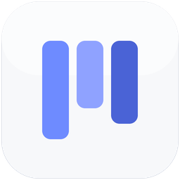

<div align="center">



# Vibe-TaskDeck

**人机共享任务协议 · 常驻桌面的任务小挂件**

[](https://github.com/Teddysht/Vibe-TaskDeck/releases/latest)
[](https://github.com/Teddysht/Vibe-TaskDeck/releases/latest)
[](https://tauri.app)
[](https://react.dev)
[](https://www.rust-lang.org)
[](https://www.sqlite.org)
[](#开源许可)

**[⬇️ 下载安装](https://github.com/Teddysht/Vibe-TaskDeck/releases/latest)** · **[📘 技术文档](docs/TECHNICAL.md)** · **[🚀 快速开始](#快速开始)** · **[🤖 让 AI 帮你管任务](#让-ai-帮你管任务)** · **[❓ 常见问题](#常见问题)**

</div>

---

---

## 这是什么？

一个**常驻桌面的任务小挂件**：平时缩在屏幕角落当一条小小的「胶囊」，只显示当前最重要的一件事；点开变身为任务面板；再点一下还能展开全功能看板（拖拽卡片改状态、筛选、搜索、详情编辑全都行）。

它最特别的地方是：**你和你的 AI 助手共用同一块任务板**。

> 📖 场景：你对 AI 说「帮我整理一下这个项目的待办」，AI 把任务一条条建好——几秒后它们就出现在你屏幕角落的挂件上。你拖着卡片推进度，AI 也能看到最新状态接着干活。双方不会互相覆盖对方的操作。

不需要装数据库软件，不需要开浏览器，不需要启动任何服务——所有数据存在你电脑上的一个文件里（SQLite），装好就能用。

## 三种形态，越点越深

| 形态 | 大小 | 什么时候用 |
| --- | --- | --- |
| 🟢 **胶囊**（默认） | 280×56 的小条 | 常驻屏幕角落，扫一眼当前任务；多个任务自动轮播 |
| 📋 **面板** | 360×520 | 点胶囊展开：任务列表、新建任务、一键流转状态、看详情写评论 |
| 🗂 **全版看板** | 独立大窗口 | 面板顶部点「⛶」图标打开：七列看板拖拽、筛选搜索、标签、附件、归档、撤销、设置（⚙ 含检查更新） |

> 💡 **关闭挂件 ≠ 退出**：点 × 只是收进系统托盘（常驻后台），托盘左键随时唤回；托盘右键 →「退出」才是真正退出。新版本发布时 ⚙ 齿轮上会出现小圆点提醒。

## 快速开始

> 🎁 **普通用户免构建**：直接到 [Releases](https://github.com/Teddysht/Vibe-TaskDeck/releases/latest) 下载 `taskdeck-widget_x64-setup.exe`，双击安装（自带桌面快捷方式与开机自启选项），装完即用——下面 4 步是给需要 AI 命令行或想改代码的人的完整路径。

### 第 0 步：准备工作（只需一次）

装三样东西，都是下一步下一步的常规安装：

| 要装什么 | 用来干嘛 | 下载地址 |
| --- | --- | --- |
| **Node.js 22.5 以上** | 运行 AI 命令行工具 | [nodejs.org](https://nodejs.org)（选 LTS 版本即可） |
| **Python 3** | 运行本项目的启动脚本 | [python.org](https://www.python.org/downloads/)（安装时勾选 Add to PATH） |
| **Rust 工具链** | 只在**第一次构建挂件**时需要 | [rustup.rs](https://rustup.rs)（装完重开一次终端） |

> 💡 如果暂时只想用 AI 命令行（不想要桌面挂件），装 Node.js 就够了。

### 第 1 步：把项目拿到本地

```powershell
git clone https://github.com/Teddysht/TaskDeck.git
cd TaskDeck
```

（也可以直接下载 ZIP 解压，效果一样。）

### 第 2 步：建第一个任务

```powershell
python skill/taskboard.py taskctl issue create --project local --title "我的第一个任务" --thread-id my-session
```

看到一段 JSON 输出、里面有任务编号（`LOCAL-1` 这样的格式）就成功了。

> 📦 **数据层自研，克隆即可用**：`taskctl` 的数据层是仓库内自研实现（`cli/database.mjs`，基于 Node 24 内置的 node:sqlite），与桌面挂件共用同一个 SQLite 文件——不需要安装数据库软件，也不依赖任何外部代码快照或后台服务。

### 第 3 步：构建并启动桌面挂件

```powershell
# 第一次需要构建（约几分钟，之后不用再跑，除非你改了代码）
cd widget
npm install
npm run build
cd src-tauri
cargo build --release
cd ../..

# 启动挂件——屏幕右上角出现小胶囊
python skill/taskboard.py widget
```

点一下胶囊 → 展开面板 → 能看到刚才建的任务。点面板顶部的「⛶」图标 → 打开全版看板。

**完成！** 🎉 想关掉挂件：`python skill/taskboard.py widget stop`。

## 日常使用

- **看进度**：瞄一眼角落胶囊即可；点它展开完整列表。
- **加任务**：面板里点「新建任务」；或让 AI 加（见下节）。
- **推进度**：面板里点任务旁的状态按钮；或全版看板里把卡片拖到对应列。
- **等验收 / 被阻塞**：AI 把任务推到待评审或标记阻塞时，Windows 右下角会弹系统通知——**点通知直接跳到该任务详情**，不用自己找。
- **改错了**：全版看板里按 `Ctrl+Z` 撤销。
- **搜任务**：全版看板里按 `/` 直接跳到搜索框。
- **换深浅色**：面板右上角有主题切换按钮。
- **数据在哪**：`TaskDeck/.data/taskboard.sqlite`——一个文件就是全部数据，备份它就是备份所有任务。

## 让 AI 帮你管任务

本项目的核心玩法。把 `skill/` 目录交给你的 AI 助手（Claude Code / Codex 等）作为技能（skill）安装，之后直接用自然语言吩咐：

> 「帮我把登录 Bug 建成紧急任务，然后认领它开始修」

AI 会通过 `taskctl` 命令建任务、认领、推进、评审——每一步都实时反映在你的桌面挂件上。人和 AI 同时操作也安全：任务带版本号，谁改旧了谁的提交会被拦下来重试，不会互相覆盖。

完整的 AI 工作流协议（认领 → 推进 → 评审 → 完成）见 [`skill/SKILL.md`](skill/SKILL.md)。

<details>
<summary>📖 skill 管理命令速查（点开）</summary>

| 命令 | 说明 |
| --- | --- |
| `status` | 看挂件进程、数据目录状态 |
| `widget` / `widget stop` | 启动 / 停止桌面挂件 |
| `taskctl <子命令>` | AI 任务命令（本地直连数据库） |
| `stop` | 停止本 skill 托管的挂件进程 |
| `clean --keep-data` | 停止挂件、清状态，**保留数据** |
| `clean --purge` | 删除运行目录（不动任务数据，不可逆） |
| `clean --purge-data` | **连任务数据一起删**（会先停挂件，不可逆） |

</details>

## 常见问题

**Q：挂件点开是黑的 / 全版看板打不开？**
先 `python skill/taskboard.py status` 看挂件是否在运行；确认构建时 `npm run build` 和 `cargo build --release` 两步都跑过且没报错（顺序不能颠倒）。

**Q：AI 建的任务，挂件上多久能看到？**
挂件约 5 秒轮询一次外部写入，最多等 5 秒就会刷新出来。

**Q：系统通知（待评审 / 阻塞弹窗）不弹？**
按顺序检查：① Windows 设置 → 系统 → 通知，「获取来自应用和其他发送者的通知」总开关需打开；② 专注助手 / 勿扰模式是否拦截。挂件启动时会自动注册自己的通知身份（AUMID），正常免安装直跑也无需手动处理。

**Q：能多人/多台电脑共享一块板吗？**
当前版本是纯本机使用（单机全功能）。数据就是 `.data` 目录下那一个文件，想搬走/备份直接复制它。

**Q：支持 Mac / Linux 吗？**
目前只支持 Windows（挂件依赖 Windows 的 WebView2 与窗口特性）。

**Q：我的任务数据会被上传吗？**
不会。任务数据纯本地存储（`.data` 目录下单个 SQLite 文件）。唯一的网络请求是启动时访问 GitHub 查询一次新版本（仅读取 Release 标题，不含任何本地数据；失败静默跳过）。

## 参与开发

- 架构、构建、命令层、测试体系等实现细节：**[📘 技术文档](docs/TECHNICAL.md)**
- 产品定位与边界：[PRODUCT.md](PRODUCT.md)
- AI 工作流协议：[skill/SKILL.md](skill/SKILL.md)
- 跑测试：`cd widget; npm run build; cd tests; node run-all.mjs`

## 开源许可

基于 [dashi-taskboard](https://github.com/chuspeeism/dashi-taskboard)（Apache-2.0）封装与增强，本仓库同样以 **Apache-2.0** 发布。
